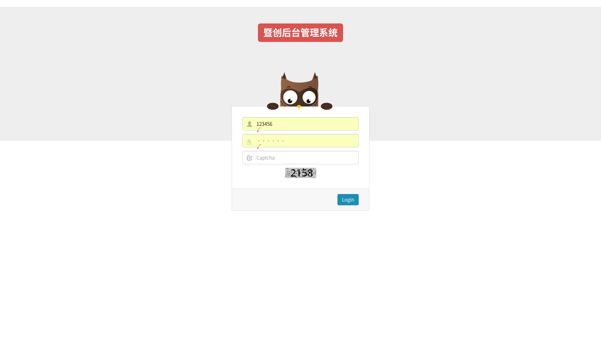
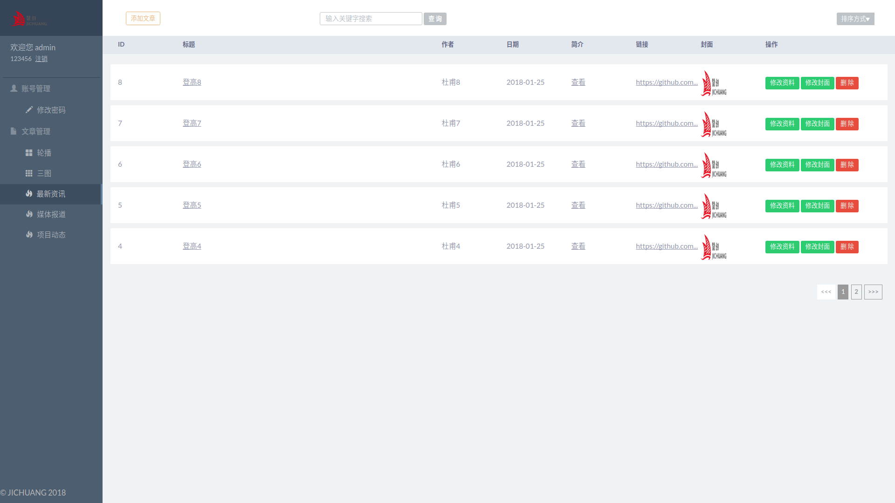

# 内容管理系统

## 开发环境
1. IntelliJ IDEA 2017 (org.apache.maven.archetypes:maven-archetype-webapp)
2. Apache Tomcat 8.5.16
3. 服务端基于 Spring + SrpingMVC + Hibernate
4. 客户端基于 Jquery + Bootstrap
5. 数据库 MySQL 5.7.18

## 功能说明
1. 登录 (123456 123456)

2. 增删改查


## 运行项目
1. 导入 admin 数据库
```
source admin.sql
```
2. 导入 crowdfunding 工程
```
File -> new -> Module from Existing Sources... -> 选中pom.xml文件 -> 一直next
```
3. 配置启动服务器 http://localhost:8080/admin/index.jsp

## 数据库相关
1. 配置数据库  
sudo vim /etc/mysql/my.cnf (copy or edit)
```
[mysqld]
character_set_server=utf8
[mysql]
default-character-set=utf8
[client]
default-character-set=utf8
[mysqldump]
user=root
password=123456
```
2. 重启数据库
```
service mysql restart
```
3. 配置 crond  
sudo vim /etc/crontab (sudo chmod -x mysql_databak.sh)
```
00 22 * * * root ./home/mysql_data/mysqldata_bak.sh # 表示每天22点00分执行备份
```
4. 重启 crond
```
service cron stop # 停止
service cron start # 启动
/etc/init.d/cron restart # 重启
```

## 接口相关
0. type(类型): lb(轮播) st(三图) zxzx(最新资讯) mtbd(媒体报道) xmdt(项目动态)
```
# 数据库一览
`id`			int(11)				NOT NULL,
`author`	varchar(255)	DEFAULT NULL,
`content`	varchar(255)	DEFAULT NULL,
`date`		varchar(255)	DEFAULT NULL,
`image`		varchar(255)	DEFAULT NULL,
`title`		varchar(255)	DEFAULT NULL,
`type`		varchar(255)	DEFAULT NULL,
`url`			varchar(255)	DEFAULT NULL,
```
1. 查询最新资讯 get
```
http://localhost:8080/admin&type=zxzx&page=0&asc=false&keyword=test
参数：type 类型 page 当前页面 asc 是否顺序 keyword 关键字
响应：JSON(List<Article>) ......
Article: [id ID, title 标题, author 作者, date 日期, content 简介, url 链接, image 封面]
```
2. 添加最新资讯 post formdata
```
参数：title 标题, author 作者, date 日期, content 简介, url 链接, image 封面, type 类型
响应：true false
```
3. 修改最新资讯(文章) post
```
参数：id ID, title 标题, author 作者, date 日期, content 简介, url 链接
响应：true false
```
4. 修改最新资讯(封面) post formdata
```
参数：id ID, image 封面
响应：true false
```
5. 删除最新资讯 post
```
参数：id ID
响应：true false
```
